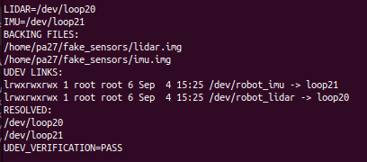

# 모듈 ① — 배달 로봇 온보딩

## 문제 1. 연산 분담과 실시간성

### 입력 사양

| 센서/장치 | 갱신률 |
|---|---:|
| 2D LiDAR | 15 Hz |
| RGB 카메라 | 60 fps, 1280×720 |
| IMU | 400 Hz |
| 바퀴 엔코더 | 2 kHz |

### 연산 분담

| 작업 | 위치 | 지연 예산 | 판단 근거 |
|---|---|---:|---|
| 모터 속도 제어 | 임베디드 | 1 ms | 지연이 생기면 속도·자세가 즉시 흔들린다. |
| 장애물 감지 | Edge | 100 ms | 센서 원본을 가까운 곳에서 처리해야 제동 지연을 줄인다. |
| 보행자 인식 | Edge AI | 100 ms | 영상 원본을 LTE로 계속 보내기에는 전송량이 너무 크다. |
| 지도 기반 경로 계획 | 클라우드 | 1~5 s 또는 재계획 시 | 긴급 제어가 아니라 지도 계산·업데이트 작업이다. |
| 배달 완료 사진 업로드 | 클라우드 | 수 분 | 주행 제어와 직접 연결되지 않는 이벤트 작업이다. |
| 운행 로그 집계 | 클라우드 | 1분~1시간 | 저장 후 배치 분석이 가능하다. |

### 카메라 원시 전송량

```text
1280 × 720 × 3 Bytes = 2,764,800 Bytes/frame
2,764,800 × 60 fps = 165,888,000 Bytes/s
                     = 약 165.9 MB/s
                     = 약 1,327 Mbps
```

가이드의 LTE 조건(업로드·다운로드 95~100 Mbps)을 적용하면 raw 영상은 LTE 업링크보다 약 13.3~14.0배 크다.
따라서 영상 원본을 계속 클라우드로 보내는 설계는 성립하지 않는다. 영상은 Edge AI에서 처리하고,
사람 위치·검출 결과·저해상도 썸네일처럼 작은 결과만 LTE로 전송한다.

### 멀티레이트 흐름

```text
엔코더 2 kHz ──> 임베디드 PID 1 kHz ──> 모터 드라이버
IMU 400 Hz ────> 자세/오도메트리 400 Hz
LiDAR 15 Hz ───> 장애물 감지 15 Hz ───> 국소 계획 10 Hz
카메라 60 fps ─> 보행자 인식 10~30 Hz ─> 국소 계획 10 Hz
전역 경로 0.1~1 Hz ───────────────────> 국소 계획 10 Hz
```

빠른 센서는 상태를 계속 갱신하고, 느린 판단 모듈은 실행 시점의 최신 상태를 사용한다. 제어기는 새 목표가 올 때까지 마지막 목표 속도를 유지한다.

### 실시간성

| 등급 | 작업 | 마감 초과 시 결과 |
|---|---|---|
| Hard | 모터 PID, 엔코더 처리, 비상정지 | 제어 불안정, 위치 오차, 충돌 위험이 발생한다. |
| Firm | 장애물 감지, 국소 계획 | 늦은 결과를 폐기하고 최신 결과를 사용해야 한다. |
| Soft | 보행자 인식, 전역 계획 | 기능은 계속되지만 인식 품질과 사용자 경험이 저하된다. |
| 비실시간 | 사진 업로드, 로그 집계 | 주행 제어에는 직접 영향이 없다. |

- 주기: 작업이 반복되는 시간 간격이다. 예를 들어 1 kHz PID의 주기는 1 ms다.
- 지연: 입력이 발생한 뒤 결과가 적용될 때까지 걸리는 시간이다.
- 지터: 예정된 주기나 실행 시점이 매번 흔들리는 정도다.

## 문제 2. SSH와 udev

### SSH 확인

Linux에서 실행:

```bash
sudo apt update
sudo apt install -y openssh-server
sudo systemctl enable --now ssh
systemctl status ssh --no-pager
ss -tlnp | grep ':22'
```

MacBook에서 Linux PC에 접속:

```bash
ssh pa27@10.2.17.4
who
echo "$SSH_CONNECTION"
ssh pa27@10.2.17.4 'uname -a'
scp /tmp/robot_scp_test_20260902.txt pa27@10.2.17.4:/tmp/
```

실제 확인 캡처:


서버에 등록하는 것은 공개키이고, 개인키는 클라이언트에만 보관한다. `who`의 `pts/N`과 `SSH_CONNECTION`으로 원격 세션을 확인한다.

### 가상 센서와 udev

```bash
mkdir -p ~/fake_sensors
cd ~/fake_sensors
truncate -s 16M lidar.img
truncate -s 24M imu.img
sudo losetup -f --show lidar.img
sudo losetup -f --show imu.img
cat /sys/block/loopN/loop/backing_file
```

연결 순서가 바뀌어도 센서 역할을 구분하는 기준은 loop 번호가 아니라 `loop/backing_file`이다.

제출 규칙 파일: [`rules/99-robot-sensor.rules`](rules/99-robot-sensor.rules)

```udev
SUBSYSTEM=="block", KERNEL=="loop*", ATTR{loop/backing_file}=="/home/pa27/fake_sensors/lidar.img", SYMLINK+="robot_lidar", MODE="0660", GROUP="disk"
SUBSYSTEM=="block", KERNEL=="loop*", ATTR{loop/backing_file}=="/home/pa27/fake_sensors/imu.img", SYMLINK+="robot_imu", MODE="0660", GROUP="disk"
```

| 키 | 의미 |
|---|---|
| `SUBSYSTEM` | 장치가 속한 커널 하위 시스템 조건 |
| `KERNEL` | 커널 장치명 조건 |
| `ATTR{}` | 현재 장치의 sysfs 속성 조건 |
| `ATTRS{}` | 상위 장치까지 검색하는 속성 조건 |
| `SYMLINK+=` | `/dev` 아래 별칭 추가 |
| `MODE=` | 장치 권한 설정 |
| `GROUP=` | 장치 소유 그룹 설정 |
| `==` | 조건 비교 |
| `=` | 속성 지정 |
| `+=` | 기존 값에 추가 |

확인 명령:

```bash
sudo udevadm control --reload-rules
sudo udevadm trigger
ls -l /dev/robot_*
readlink -f /dev/robot_lidar
readlink -f /dev/robot_imu
```

실제 캡처:


실제 USB 센서로 바꿀 때는 다음처럼 부모 USB 속성을 사용한다.

```udev
SUBSYSTEM=="tty", ATTRS{idVendor}=="10c4", ATTRS{idProduct}=="ea60", SYMLINK+="robot_lidar", MODE="0660", GROUP="dialout"
SUBSYSTEM=="tty", ATTRS{idVendor}=="10c4", ATTRS{idProduct}=="ea70", SYMLINK+="robot_imu", MODE="0660", GROUP="dialout"
```

## 문제 3. Git 협업

문제 3은 제출 저장소와 별도의 연습 저장소에서 수행해야 한다.

```bash
git clone <practice-repository-url>
cd <practice-repository>
git switch -c feature/compute-layout
git switch -c feature/udev-rules
git switch -c branch-a
git switch -c branch-b
git rebase main
git log --oneline --graph --all
```

보고서에 별도 연습 저장소 URL, PR URL, 실제 리뷰 코멘트, conflict 발생·해결 출력, merge/rebase 그래프를 추가한다. 현재 저장소에는 해당 외부 연습 저장소와 PR URL을 임의로 만들지 않고 미기재 상태로 남겼다.

## 2026-09-04 Linux 재검증

실제 Linux에서 `/tmp/verify_module1_udev.sh`를 실행했다. 확인 결과는 다음과 같다.

실제 터미널 캡처: 

```text
LIDAR=/dev/loop20
IMU=/dev/loop21
/home/pa27/fake_sensors/lidar.img
/home/pa27/fake_sensors/imu.img
/dev/robot_lidar -> /dev/loop20
/dev/robot_imu -> /dev/loop21
UDEV_VERIFICATION=PASS
```

loop 번호와 관계없이 `loop/backing_file`로 lidar/imu를 식별하고, udev 링크의 실제 대상이 각각의 backing file과 일치함을 확인했다.
