# 배달 로봇 온보딩

## 문제 1번 - 배달 로봇의 연산 분담과 실시간성 설계

* 배달 로봇에 다음이 실려 있다고 가정합니다 — 2D 라이다(10Hz), RGB 카메라(30fps·1080p), IMU(200Hz), 바퀴 엔코더(1kHz), 모터 드라이버, LTE 모듈.
* 이 로봇이 하는 작업 여섯 가지(모터 속도 제어, 장애물 감지, 보행자 인식, 지도 기반 경로 계획, 배달 완료 사진 업로드, 운행 로그 집계)를 **임베디드 / Edge AI / 클라우드** 중 어디서 처리할지 표로 배치하고, **지연 예산과 데이터 전송량을 근거로** 각각 이유를 쓰세요(1강).
* 카메라 원시 영상을 클라우드로 계속 보내면 초당 몇 MB 인지 계산하고, LTE 대역폭과 비교해 그 설계가 왜 성립하지 않는지 수치로 보이세요.
* 같은 작업들을 **인지 → 판단 → 제어** 계층에 매핑하고, 계층별 갱신 주기를 적어 **멀티레이트 데이터 흐름**을 그림이나 표로 정리하세요(2강).
* 여섯 작업을 **Hard / Firm / Soft 실시간**으로 분류하고, Hard 로 분류한 작업이 마감을 놓치면 어떤 물리적 결과가 생기는지 한 줄씩 쓰세요.
* **주기·지연·지터**를 이 로봇의 예로 각각 한 문장씩 구분해 설명하세요.

### 가정

$$
\text{초당 전송량 (Bytes/s)} = \text{전송 주기 (Hz)} \times \text{1회 전송 패킷 크기 (Bytes)}
$$

$$
\text{대역폭 (Mbps)} = \frac{\text{초당 전송량 (Bytes/s)} \times 8 \text{ bits}}{1,000,000}
$$

* wheel Encoder = 1kHz(가정) = 1000 Hz (즉 1초에 1000번 전송)

  * 위에 수식과 같이 생각해보면, 먼저 바퀴 엔코더에서 주는 현 바퀴의 상태 값은 float의 실수 값으로, 1초에 1000번 전송하게된다.
    float64 타입의 기본 포맷은 하나의 float64당 64bits = **8Bytes**, 즉 1초에 1000번씩, 8000Bytes 전송 = 8KB/s 여기에 2륜이라 바퀴수 2를 곱해서 초당 16KB/s 데이터가 전송
* IMU = 200hz(가정)

  * IMU(Inertial Measurement Unit)는 관성 측정 장치

    * 64 Bytes IMU 테이터

      * 자세 Orientation
        * 쿼터니언 (4개의 수로 이루어진 값 x,y,z,w)
        * 즉, float64형(8Bytes) 실수 값 4개 -> 4 * 8Bytes = 32 Bytes
      * 회전 각속도 Angular Velocity
        * 각속도, 회전할 때 각 축(Roll, Pitch,Yaw)을 중심으로 1초에 몇 라디안(각도) 만큼 빠르게 회전하는지에 대한 각 x,y,z 값
        * 즉, float64형(8Bytes) 실수 값 3개 -> 3 * 8Bytes = 24 Bytes
        * Vx Vy Vz
      * 선형 가속도 Linear Acceleration
        * 밀어내는힘, 로봇이 출발하거나 멈출때 각 3축에 방향으로 가해지는 가속도 x,y,z
        * 즉, float64형(8Bytes) 실수 값 3개 -> 3 * 8Bytes = 24 Bytes
        * xyz
      * 3종류의 데이터 합의 크기
        * 32Bytes(자세) + 24Bytes(회전속도) + 24Bytes(가속도) = 80 Bytes(1회 당)
        * 1초당 200hz(가정) -> 200번, 즉 200 * 80  = 16,000 Bytes/s = **16KB/s**
    * 32 Bytes IMU 테이터

      * 선형 가속도 **3축 (** $a_x, a_y, a_z$**)**

        * **각 4바이트 크기의 단정밀도 실수형(**`float32`) = **12바이트**
      * 회전 각속도 **3축 (** $Vx, Vy, Vz$**)**

        * **각 4바이트 크기의 단정밀도 실수형**(`float32`) = **12바이트**
      * 시스템 타임 스탬프

        * **시스템 타임스탬프 (시간 기록)** **: 8바이트 정수형 또는 실수형 (**`uint64` / `float64`) = **8바이트**
      * **1회 전송 패킷 총합** : 12B + 12B + 8B = **32 바이트**
      * 200Hz 전송 주기 기준 계산

        * 갱신주기 1초에 200번, -> 1회당 1000 / 200 초 -> **5 ms**
        * 패킷(한번의 전송 데이터량) -> **32 바이트**
        * 초당 데이터 전송량

          * **32 Bytes * 200 Hz = 6,400 Bytes/s = 6.4 KB/s**
        * 네트워크 소요 대역폭

          $$
          6,400 \text{ Bytes/s} \times 8 \text{ bits/Byte} = 51,200 \text{ bps} \approx \mathbf{0.0512 \text{ Mbps}}
          $$
* lidar = 10hz(가정)

  * 10hz -> 1초에 10바퀴 회전 해서 스캔 (센서 회전 주기) -> 1초에 10번 스캔 -> 1000ms -> 10번 -> 1번 = 100ms
  * 360 -> 한 바퀴당 측정되는 포인트의수 1도씩 360도 측정
  * 4B + 4B -> 2가지 측정데이터의 합
    * 장애물까지의 거리
      * Range(거리)을 float32으로 사용 4B 실수
      * Intensity(반사도) 또는 Angle(측정 각도)을 float32으로 사용 4B 실수
  * 최종적인 가정 계산
    * 1회 회전 스캔 데이터 크기 = 360 * (4B + 4B) = 2880 Bytes
    * 1바퀴당 값 * 10번의 회전(10 Hz 이기때문) = 2,880 Bytes * 10 Hz = 28,800 Bytes/s = 28.8 KB/s
      * 1초당 28.8 KB의 데이터 전송
      * 네트워크 대역폭 (Mbps) 계산
        * 28.8 KB = 28,800 B
        * 28,800 * 8(bits) = 230,400 bits
        * 230,400 / 1,000,000  = **약 0.2304 Mbps**
* cam = 33ms(가정)

  * Full HD 기준(해상도 1920 * 1080, 30fps)
    * 화소수 1920 *1080 = 2,073,600 픽셀
    * 1픽셀 = 3 Bytes
      * 픽셀은 RGB (각, 레드, 그린, 블루 의 색상 밝기를 0~255의 정수로 표현)
    * 2,073,600 * 3 Bytes = 6,220,800 Bytes -> 약 6.2 MB (1,000,000 Bytes = 1MB)
    * 6.3MB 크기의 대의터랑 1초당 30번 (frame per second, 즉 1초당 30장의 이미지 데이터를 주어야함)
      * 6,220,800 Bytes * 30 = 186,624,000 Bytes /s = 약 186.6MB/s
    * 네트워크 대역폭 (Mbps) 계산
      * bits 환산 ->약 186.6 (MB) * 8 (bits) = 1,492,992,000 bps
      * Mbps(Mega bits per second) 환산 = 1,492,992,000 / 1,000,000 => 1,492.992 Mbps (약 1,500 Mbps)
* LTE = 50 Mbps (이론 상 최대), 실측 5~20 Mbps

  * 실제 5~20 Mbps 속도, 지연 시간은 30
  * RTT
    * 물리적 (터널·지하에서 끊김 상황 등 )왕복 에 따른 (부품 -> LTE 통신(전송) -> LTE 전송 받는 부품 -> LTE 통신(회신) -> 부품)
    * 지연 시간은 5 ~ 20 Mbps ->  30 ~ 100 ms
* 배달 로봇의 주행 속도

  * 보도 주행 규정 v = 1.5m/s, 감속도 a = 2 m/s²
    * 제동 거리
      * 로봇이 실제로 브레이크를 밟아서, 감속을 시작한 순간 부터 완전히 속도가 0이 되어 멈출때 까지의 미끄러지며 나아가는 거리
      * 등가속도 운동 법칙

        $$
        \text{제동 거리} = \frac{v^2}{2a}
        $$
      * * $v$ ** (초기 주행 속도)** **: **$1.5\text{ m/s}$** (시속 약 **$5.4\text{ km/h}$**)**
        * $a$ ** (브레이크 감속도)** **: **$2\text{ m/s}^2$
        * **계산** **:**
        * $$
          \text{제동 거리} = \frac{1.5^2}{2 \times 2} = \frac{2.25}{4} = \mathbf{0.5625\text{ m (약 0.56 m)}}
          $$

          $$
          \text{총 정지 거리} = (1.5 \times \text{지연 시간}) + 0.56\text{ m}
          $$

          ```
                 장애물 발견                 브레이크 작동                 완전 정지
                      │                            │                            │
                      ▼ ─── [ 반응 거리 (지연) ] ─── ▼ ──── [ 제동 거리 (물리) ] ───   ▼
                      └─────────── 15 cm ──────────┘└─────────── 56 cm  ─────────┘
                      ├───────────────────────── 총 71 cm ────────────────────────┘
          ```

### 연산 분담 배치표

* 지연 예산
  * LTE 통신 기준 RTT (30 ~ 100 ms) 보다 빠르다면 임베디드 혹은 Edge AI에 있어야 함
* 데이터량
  * LTE 통신 기증 업링크(5 ~ 20 Mbps)를 넘기면, 임베디드 혹은 Edge AI에 있어야 함

|         작업         |   위치   | 지연 예산                                                       | 데이터량(전송량)                                                                         | 근거                                                                                                                                                                                                            |
| :-------------------: | :------: | --------------------------------------------------------------- | ---------------------------------------------------------------------------------------- | :-------------------------------------------------------------------------------------------------------------------------------------------------------------------------------------------------------------- |
|   모터의 속도 제어   | 임베디드 | **≤ 1 ms**                                               | **16KB/s**                                                                         | LTE RTT30~100기준 최소 30 ~ 100배 네크워트 통신 불가능 =**클라우드 부적합**, Edge 컴퓨터의 OS 주기도 1ms를 보장 못함 = **Edge AI 부적합** 빠른 반응요구 + 적은 데이터양 = **임베디드 적합**  |
|      장애물 감지      | Edge AI | **≤ 100 ms**                                             | Lidar 데이터<br />**28,8 KB/s**                                                    | LTE를 통한 통신시 반응거리 지연(≥ 30m/s)에 따라서 15cm 가 이동될수 있음 (사고) =**클라우드 부적합**, 받아온 라이다 데이터를 연산 작업해서 판별하는 기능 필요 = **임베디드 부적합 및 Edge AI 적합** |
|      보행자 인식      | Edge AI | **≤ 100 ms**                                             | cam 데이터<br />**186.6 MB/s**                                                     | 라이더 원시 데이터 전부를 LTE 통한 통신을 하면 업로드시 50Mbps 의 30배가 필요합 =**클라우드 부적합**, 원시데이터를 통한 결과만 전달하면됨 = **Edge AI 적합**                                       |
|  지도 기반 경로 계획  | 클라우드 | **1~5 s 계획이 필요한 케이스시에만 한정 (출발, 재 출발)** | **약 수백 B**                                                                      | 지도 데이터 자체가 큼 (약 수 GB 예상) = 서버에 데이터 보관 및 시급성이 필요한 데이터가 아님 =**클라우드 적합**                                                                                            |
| 배달 완료 사진 업로드 | 클라우드 | **수 분까지 허용**                                        | 1장의 이미지 파일 최대 약 6.2 MB(cam 기준)                                              | 시급성이 없는 데이터**클라우드 적합**                                                                                                                                                                     |
|    운행 로그 집계    | 클라우드 | **급한 값이 아니라서 최대 시간까지 허용**                 | 텍스트로 이루어진 로그 파일 약<br />수십 KB/s 의 쌓인 파일 압축해서 전송 최대 100MB 이하 | 데이터를 바로 활용하지 않고, 수집후에 이용 =**클라우드 적합**                                                                                                                                             |

## 문제 2번 - 카메라 원시 영상 전송량

### 카메라 원시 영상 전송량

- 로봇에 부착된 카메라를 통해 촬영된 데이터를 raw 데이터 크기
- FHD 화소(1920 * 1080)기준

  - 1 프레임 데이터 양 = 1920 * 1080 * 3B(RGB) = 6,220,000 B = 약 **6.22 MB**
- 초당 전송량 30 Fps (1초에 30장(프레임))

  - 6,220,000 B * 30 fps = 186,624,000 B/s = **약 186.6 MB/s**
  - 비트 환산 (* 8)
    - 186,624,000 (Bytes) * 8 (bits) = 1,492,992,000 bps = 약  1,493 Mbps = **약 1,5 Gbps**
- LTE

  - LTE 모듈의 실제 업링크 대역폭은 **실측 5~20 Mbps**
  - 카메라 원시 영상 전송 대역폭(약 $1,500 \text{ Mbps}$)은 실제 LTE 전송 대역폭 한계선($5 \sim 20 \text{ Mbps}$)을 **약 75배에서 최대 300배 초과**
- 결론

  - LTE 네트워크 사용시 실측 하한,상한($5 \sim 20 \text{ Mbps}$) 모두 충족할수 없는 데이터양
  - **약 186.6 MB/s 대비 0.625 MB/s ~ 2.5 MB/s**

---

## 문제 3번 - 인지 판단 제어 계층 맵핑과 주기표

### 계층별 갱신 주기표

| 계층       | 작업                     | 갱신 주기                   | 실행 위치             | 입력 → 출력                                                       |
| ---------- | ------------------------ | --------------------------- | --------------------- | ------------------------------------------------------------------ |
| 인지       | 바퀴 엔코더 읽기         | 1 kHz                       | 임베디드              | 바퀴가 회전한 신호 → 바퀴가 도는 속도                             |
| 인지       | IMU 읽기·자세 융합      | 200 Hz                      | 임베디드/Edge         | 가속도와 도는 속도 센서 값 → 몸체가 기울어진 각도와 향한 방향     |
| 인지       | 장애물 감지              | 10 Hz                       | Edge (+ MCU 비상정지) | 라이다 레이저 측정값 → 주변 물체들과의 최단 거리                  |
| 인지       | 보행자 인식              | 30 Hz 입력 → 10~30 Hz 출력 | Edge (GPU)            | 카메라 사진 화면 → 사람의 위치와 상자 크기                        |
| 판단       | 지도 기반 전역 경로 계획 | 출발, 재계획 ≈ 0.1~1 Hz   | 클라우드              | 가야 할 목적지와 넓은 전체 지도 → 갈 수 있는 길잡이 점들의 모임   |
| 판단       | 국소 경로·속도 결정     | 10 Hz                       | Edge                  | 갈 길 정보와 눈앞의 방해물 위치 → 지금 가야 할 로봇의 진짜 속도   |
| 제어       | 모터 속도 제어 (PID)     | 1 kHz                       | 임베디드              | 목표 속도와 현재 바퀴 도는 속도 → 모터에 전달되는 전압 세기       |
| (비실시간) | 배달 완료 사진 업로드    | 이벤트(배달 완료 시)        | 클라우드              | 배달 완료 카메라 사진 → 서버에 안전히 저장하고 알림 메시지 발송   |
| (비실시간) | 운행 로그 집계           | 배치 1/분~1/시간            | 클라우드              | 로봇 내부의 주행 기록 파일 → 인터넷 화면에 통계로 그려서 보여주기 |

### 멀티 레이트 데이터 흐름

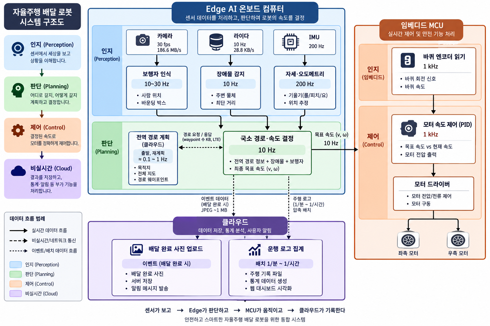

| 생산 모듈        | 생산 주기         | 소비 모듈            | 소비 주기 | 결합 방식                              |
| ---------------- | ----------------- | -------------------- | --------- | -------------------------------------- |
| 엔코더           | 1 kHz             | PID 모터 제어        | 1 kHz     | 거의 1:1 실시간 결합                   |
| IMU              | 200 Hz            | 자세·오도메트리     | 200 Hz    | 센서 융합                              |
| 자세·오도메트리 | 200 Hz            | 국소 경로·속도 결정 | 10 Hz     | **최신 상태값 사용**             |
| LiDAR            | 10 Hz             | 장애물 감지          | 10 Hz     | 1:1 또는 최신 프레임                   |
| 장애물 정보      | 10 Hz             | 국소 경로·속도 결정 | 10 Hz     | 최신 장애물 상태                       |
| 카메라           | 30 fps            | 보행자 인식          | 10~30 Hz  | 프레임 샘플링/처리 가능한 만큼         |
| 보행자 정보      | 10~30 Hz          | 국소 경로·속도 결정 | 10 Hz     | 최신 검출 결과 사용                    |
| 전역 경로        | 0.1~1 Hz / 이벤트 | 국소 계획            | 10 Hz     | **마지막 경로를 계속 유지**      |
| 국소 계획        | 10 Hz             | PID                  | 1 kHz     | **목표값 유지(Zero-order hold)** |
| 비상정지         | 이벤트            | MCU/모터 드라이버    | 즉시      | **주기 무시, 비동기 우선 처리**  |

빠른 주기의 센서는 계속 갱신하고 → 느린 주기의 판단 모듈은 실행되는 순간 가장 최신의 유효 데이터를 가져다 쓰고 → 제어기는 마지막으로 받은 목표값을 다음 목표값이 올 때까지 유지한다.

각 모듈은 필요한 주기에 맞춰 독립적으로 동작하며, **빠른 주기의 센서는 상태값을 계속 갱신하고 느린 주기의 판단 모듈은 실행 시점의 최신 값을 사용**합니다.
 예를 들어 IMU는 200 Hz로 자세를 갱신하고 Edge는 이를 10 Hz로 읽어 경로와 목표 속도 `(v, ω)`를 결정하며, MCU의 PID 제어기는 이 목표값을
다음 명령이 올 때까지 유지하면서 1 kHz로 모터를 제어합니다. 전역 경로는 필요할 때만 재계획하고, 비상정지는 일반 주기와 관계없이 즉시 처리하는 구조입니다.

## 문제 4번 - Hard / Firm / Soft 실시간 분류표

| 실시간 분류              | 위 시스템의 예시                                     | 주기                  | 이유                                                                                                                                               |
| ------------------------ | ---------------------------------------------------- | --------------------- | -------------------------------------------------------------------------------------------------------------------------------------------------- |
| **Hard Real-Time** | **모터 속도 제어(PID), 엔코더 처리, 비상정지** | 1 kHz / 즉시          | 정해진 시간 안에 처리하지 못하면 제어 불안정이나 안전 문제로 이어질 수 있으므로**Deadline 준수가 필수**                                      |
| **Firm Real-Time** | **장애물 감지, 국소 경로·속도 결정**          | 10 Hz                 | 한두 번 늦은 결과는 시스템 장애로 직결되지는 않지만,**늦게 나온 결과는 이미 상황이 바뀌어 가치가 크게 떨어지므로 폐기하고 최신 결과를 사용** |
| **Soft Real-Time** | **보행자 인식, 전역 경로 계획**                | 10~30 Hz / 0.1~1 Hz | 약간의 지연이 발생해도 시스템이 즉시 실패하지 않으며**성능이나 사용자 경험이 점진적으로 저하**                                               |
| **비실시간**       | **배달 사진 업로드, 운행 로그 집계**           | 이벤트 / 배치         | 즉각적인 응답이 필요하지 않아 수 초~수 분 지연되어도 주행 제어 자체에는 영향이 없음                                                                |

Hard 분류한 작업이 마감을 놓칠시 발생할수 있는 상황

* **모터 속도 제어(PID)** : 마감을 놓치면 모터 출력 보정이 늦어져 **속도 불안정, 급가감속 또는 주행 궤적 이탈**이 발생할 수 있습니다.
* **엔코더 처리** : 마감을 놓치면 실제 바퀴 속도·이동량을 제때 반영하지 못해 **모터 제어 오차와 위치 추정 오차**가 커질 수 있습니다.
* **비상정지** : 마감을 놓치면 모터 차단이 지연되어 **장애물·사람과의 충돌 또는 제동거리 증가**로 이어질 수 있습니다.

## 문제 5번 - 주기,지연,지터

* **주기(Period)** : 특정 작업이 **얼마나 자주 반복되는지**를 의미합니다.
  → **예시:** 모터 PID 제어가 **1 ms마다 한 번씩 실행(1 kHz)**되어 바퀴 속도를 지속적으로 보정합니다.
* **지연(Latency)** : 입력이 발생한 시점부터 **그에 대한 실제 결과가 나오기까지 걸리는 시간**입니다.
  → **예시:** LiDAR가 장애물을 감지한 후 **50 ms 뒤에 모터 정지 명령이 적용됐다면 지연은 50 ms**입니다.
* **지터(Jitter)** : 작업의 실행 시점이나 간격이 **원래 정해진 시간에서 얼마나 흔들리는지**를 의미합니다.
  → **예시:** PID가 원래 정확히 **1 ms마다 실행**되어야 하는데 실제로는 **0.9 ms → 1.1 ms → 0.95 ms** 간격으로 실행되는 현상입니다.

---

# 문제 2. 원격 접속(SSH)과 센서 장치 경로 고정

## 2-1. 답안 요약(템플릿 1~7)

1. **고른 접속 대상:** `실제 Linux PC` — 기존 캡처의 IP는 `10.2.12.145`, 현재 IP는 `10.2.17.4`이다. MacBook에서 접속 후 `pts/1`과 `SSH_CONNECTION`이 직접 확인되었다.
2. **서버에 등록하는 키:** 공개키 — 캡처에서 `/home/pa27/.ssh/id_ed25519.pub`를 `ssh-copy-id`로 등록하고 `Number of key(s) added: 1`이 확인된다. 개인키는 클라이언트에만 보관한다.
3. **원격 단일 명령 및 SCP:** MacBook에서 원격 `uname -a` 실행, 비밀번호 없는 SSH, SCP 송신 및 Linux 수신 파일 확인을 모두 수행했다.
4. **두 장치 구분 속성:** LiDAR — `loop/backing_file=/home/pa27/fake_sensors/lidar.img`; IMU — `loop/backing_file=/home/pa27/fake_sensors/imu.img`. 최초 연결은 `/dev/loop18`=LiDAR, `/dev/loop19`=IMU로 기록되어 있다.
5. **udev 규칙:** 아래 `rules/99-robot-sensor.rules`에 제출했다. `/dev/robot_lidar`와 `/dev/robot_imu`는 각각 backing file 조건으로 만든다.
6. **순서를 바꾼 재연결 검증:** IMU를 먼저 연결해 `/dev/loop18`, LiDAR를 다음에 연결해 `/dev/loop19`가 되었지만, udev 링크는 `/dev/robot_imu -> loop18`, `/dev/robot_lidar -> loop19`로 센서 역할을 올바르게 유지했다.
7. **실제 USB 규칙:** 과제에서 주어진 `idVendor=0403`과 `idProduct=6001/6015`를 사용하는 초안을 2-5절에 제시했다. 두 장치는 Product ID가 달라 구분한다.

## 2-2. 접속 구성 및 확인 명령

**컴퓨터 역할**

- **MacBook:** SSH 클라이언트. 아래 `ssh`와 `scp`의 송신 측 명령을 실행한다.
- **Linux PC:** SSH 서버 및 가상 센서/udev 작업 대상. 사용자 `pa27`, 현재 IP `10.2.17.4` (기존 캡처 당시 `10.2.12.145`).

### Linux에서 실행 — SSH 서버 준비

```bash
sudo apt update
sudo apt install -y openssh-server
sudo systemctl enable --now ssh
systemctl status ssh --no-pager
ss -tlnp | grep ':22'
```

사용자가 Linux 터미널에서 실행한 출력으로 SSH 서버 상태를 확인했다.

```text
Active: active (running) since Wed 2026-09-02 12:31:53 KST
Server listening on 0.0.0.0 port 22.
Server listening on :: port 22.
```

따라서 SSH 서비스 실행과 TCP 22 수신은 충족되었다. 사용자가 보낸 출력에서는 명령어가 붙어 입력되어 `ufw`의 독립적인 출력은 확인되지 않았다.

### MacBook에서 실행 — Linux PC에 원격 접속

```bash
ssh pa27@10.2.17.4
```

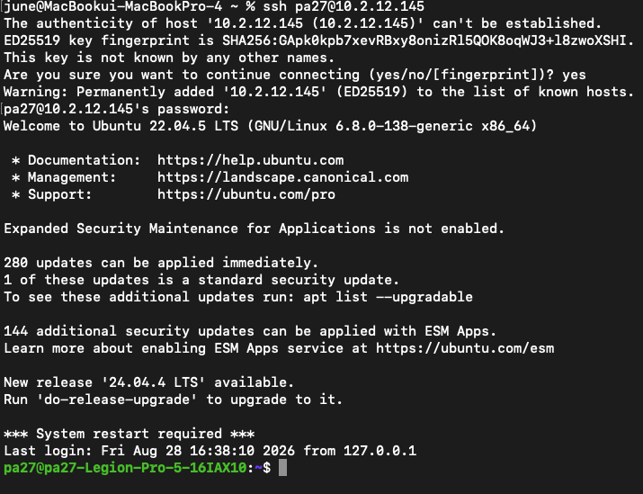

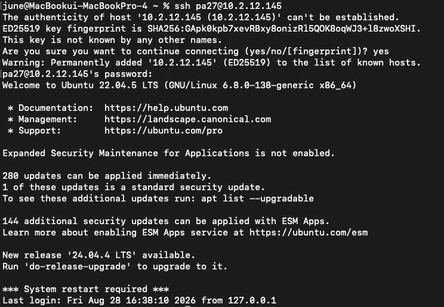

Ubuntu 환영 문구와 `pa27@pa27-Legion-Pro-5-16IAX10` 프롬프트가 확인된다. 로그인 후 Linux 셸에서 다음 두 명령을 실행했다.

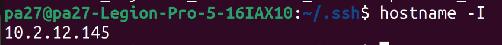

```bash
who
echo "$SSH_CONNECTION"
```

`who`에서 `pts/N`이 보여야 하고, `SSH_CONNECTION`은 `클라이언트 IP 클라이언트 포트 서버 IP 서버 포트` 형식이어야 한다. MacBook에서 실제 Linux SSH 세션으로 확인한 출력은 다음과 같다.

```text
pa27     pts/1        2026-09-02 15:00 (10.2.17.27)
SSH_CONNECTION=10.2.17.27 55391 10.2.17.4 22
```

## 2-3. 키 인증, 비대화형 명령, SCP

### MacBook에서 실행 — 공개키 생성 및 Linux 등록

```bash
ssh-keygen -t ed25519
ssh-copy-id pa27@10.2.17.4
ssh pa27@10.2.17.4
```

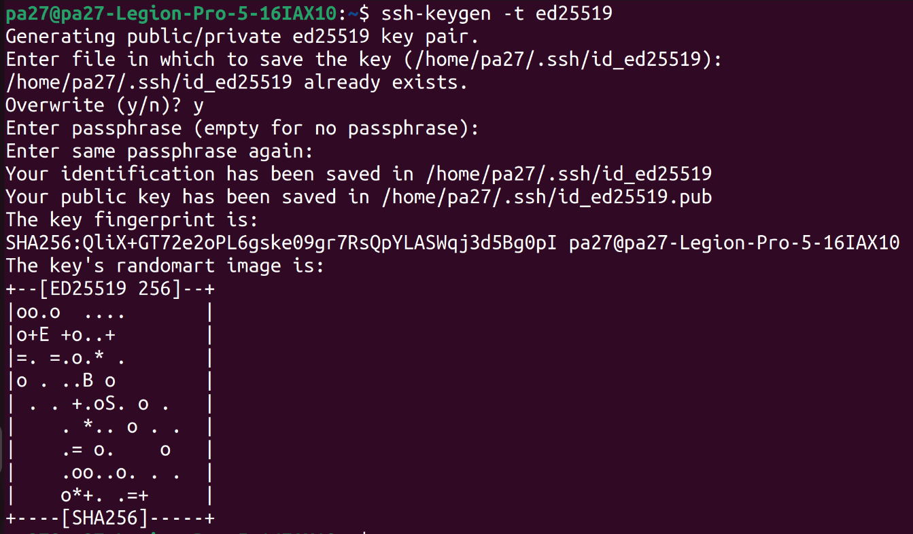

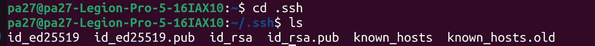

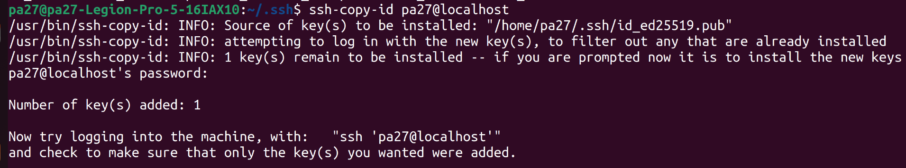

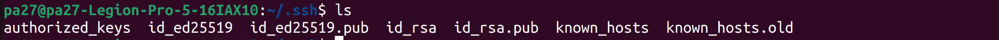

서버에 등록하는 것은 **공개키**이며, 개인키는 MacBook에만 보관한다. MacBook에서 실제로 다음 결과를 확인했다.

```text
Source of key(s) to be installed: "/Users/june/.ssh/id_ed25519.pub"
Number of key(s) added: 1
KEYLESS_OK
```

### MacBook에서 실행 — 접속하지 않고 Linux 명령 1회 실행

```bash
ssh pa27@10.2.17.4 'uname -a'
```

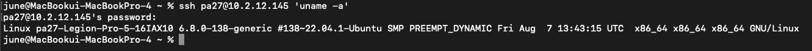

Linux 출력은 `6.8.0-138-generic`, `Ubuntu SMP`, `x86_64 GNU/Linux`로 확인된다.

### MacBook에서 실행 — SCP 전송

```bash
scp <MacBook의_테스트_파일> pa27@10.2.17.4:/tmp/
```


MacBook에서 실제 SCP 전송을 수행하고 Linux에서 검증했다.

```text
scp /tmp/robot_scp_test_20260902.txt pa27@10.2.17.4:/tmp/robot_scp_test_20260902.txt
SCP_VERIFY=robot ssh scp test
```

## 2-4. 시리얼 장치와 가상 센서

### Linux에서 실행 — 시리얼 장치 확인

```bash
ls -l /dev/tty*
```

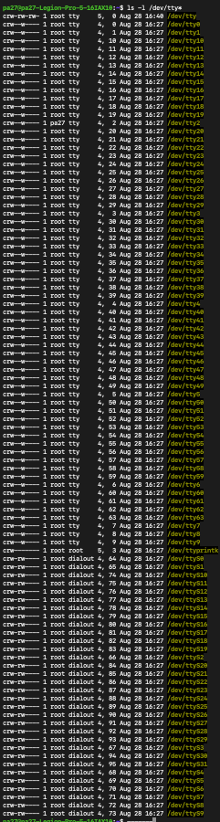

캡처에서 장치 파일의 첫 문자는 `c`이며, 다수의 장치는 소유 그룹 `tty`, 일부는 `dialout`으로 표시된다.

### Linux에서 실행 — 가상 센서 생성 및 loop 연결

```bash
mkdir -p /home/pa27/fake_sensors
cd /home/pa27/fake_sensors
truncate -s 10M lidar.img imu.img
sudo losetup -f --show lidar.img
sudo losetup -f --show imu.img
```

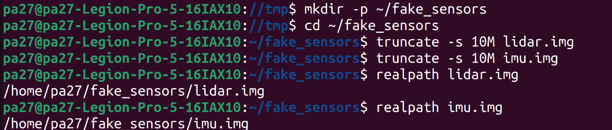

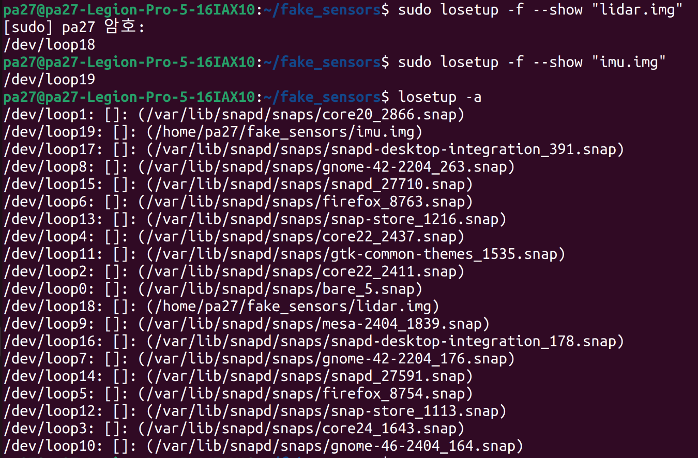

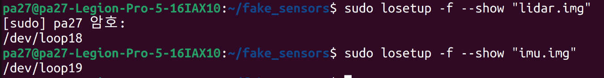

확인된 사실은 다음과 같다.

```text
/home/pa27/fake_sensors/lidar.img  → 최초 /dev/loop18
/home/pa27/fake_sensors/imu.img    → 최초 /dev/loop19
```

두 장치를 구분한 속성은 loop 번호가 아니라 `loop/backing_file`이다. 번호는 연결 순서에 따라 달라질 수 있으므로 고정 식별자로 사용하지 않는다.

### Linux에서 실행 — backing file 조사 예

```bash
udevadm info --attribute-walk /dev/loop18
udevadm info --attribute-walk /dev/loop19
```

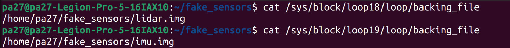

캡처에서 `/dev/loop18`은 `/home/pa27/fake_sensors/lidar.img`, `/dev/loop19`는 `/home/pa27/fake_sensors/imu.img`를 가리킨다. 추가로 Linux에서 `udevadm info --attribute-walk`를 직접 실행해 두 장치가 `SUBSYSTEM=="block"`, `KERNEL=="loop18"` 및 `KERNEL=="loop19"`임을 확인했다. 해당 명령의 출력에는 `backing_file` 행이 표시되지 않아, 실제 backing file 값은 다음 sysfs 조회 결과를 사용한다.

```bash
cat /sys/block/loop18/loop/backing_file
# /home/pa27/fake_sensors/lidar.img
cat /sys/block/loop19/loop/backing_file
# /home/pa27/fake_sensors/imu.img
```

## 2-5. udev 규칙 및 실제 USB 센서 적용 초안

제출한 규칙 파일: [`rules/99-robot-sensor.rules`](rules/99-robot-sensor.rules)

```udev
SUBSYSTEM=="block", KERNEL=="loop*", ATTR{loop/backing_file}=="/home/pa27/fake_sensors/lidar.img", SYMLINK+="robot_lidar", MODE="0660", GROUP="disk"
SUBSYSTEM=="block", KERNEL=="loop*", ATTR{loop/backing_file}=="/home/pa27/fake_sensors/imu.img", SYMLINK+="robot_imu", MODE="0660", GROUP="disk"
```

| 키/연산자      | 의미                                                                                                            |
| -------------- | --------------------------------------------------------------------------------------------------------------- |
| `SUBSYSTEM`  | 장치가 속한 커널 서브시스템을 조건으로 검사한다. loop 장치는`block`, USB 시리얼은 보통 `tty`다.             |
| `KERNEL`     | 커널 장치 이름을 조건으로 검사한다.`loop*`처럼 패턴을 쓸 수 있다.                                             |
| `ATTR{...}`  | 현재 장치의 sysfs 속성을 조건으로 검사한다. 여기서는`loop/backing_file`이다.                                  |
| `ATTRS{...}` | 현재 장치의 상위(parent) 장치까지 올라가 속성을 조건으로 검사한다. USB의`idVendor`, `idProduct`에 적합하다. |
| `SYMLINK+=`  | `/dev` 아래에 별칭 심볼릭 링크를 추가한다.                                                                    |
| `MODE=`      | 장치 파일 접근 권한을 설정한다.                                                                                 |
| `GROUP=`     | 장치 파일 소유 그룹을 설정한다.                                                                                 |
| `==`         | 조건이 값과 일치하는지 검사한다.                                                                                |
| `=`          | 속성 값을 설정한다.                                                                                             |
| `+=`         | 기존 값에 새 값을 추가한다.                                                                                     |

실제 USB 시리얼 센서에 적용할 때의 초안은 다음과 같다. `idVendor`와 `idProduct`는 일반적으로 tty 장치의 부모 USB 장치 속성이므로 `ATTRS`를 사용한다.

```udev
# LiDAR: 과제에서 제시한 USB ID
SUBSYSTEM=="tty", ATTRS{idVendor}=="0403", ATTRS{idProduct}=="6001", SYMLINK+="robot_lidar", MODE="0660", GROUP="dialout"

# IMU: 과제에서 제시한 USB ID
SUBSYSTEM=="tty", ATTRS{idVendor}=="0403", ATTRS{idProduct}=="6015", SYMLINK+="robot_imu", MODE="0660", GROUP="dialout"
```

두 센서의 `idVendor`는 모두 `0403`으로 같으므로 Vendor ID만으로 구분할 수 없다. LiDAR는 `idProduct=6001`, IMU는 `idProduct=6015`로 다르므로 두 조건을 함께 사용해 구분한다. 실제 장치의 인터페이스 구성에 따라 `KERNEL=="ttyUSB*"` 또는 `KERNEL=="ttyACM*"`를 추가할 수 있지만, 해당 장치명이 확인된 캡처가 없어 이 보고서에는 단정하지 않는다.

## 2-6. 규칙 적용 및 재연결 검증

### Linux에서 실행

```bash
sudo udevadm control --reload-rules
sudo udevadm trigger
ls -l /dev/robot_*
```

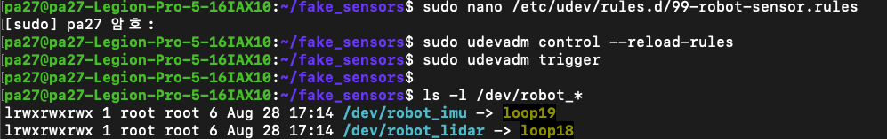

원본 기록에서 최초 결과는 다음과 같이 확인되었다.

```text
/dev/robot_lidar -> loop18
/dev/robot_imu   -> loop19
```

이후 IMU를 먼저, LiDAR를 다음에 연결한 최종 결과는 다음과 같다.

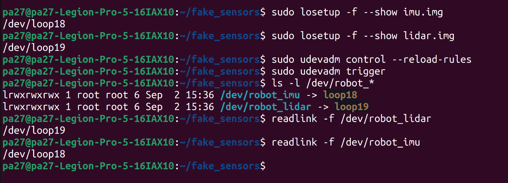

```text
/dev/robot_imu   -> loop18
/dev/robot_lidar -> loop19
readlink -f /dev/robot_lidar  → /dev/loop19
readlink -f /dev/robot_imu    → /dev/loop18
```

연결 순서가 바뀌어도 `robot_lidar`는 LiDAR, `robot_imu`는 IMU를 계속 가리키므로 고정 경로 검증을 완료했다.

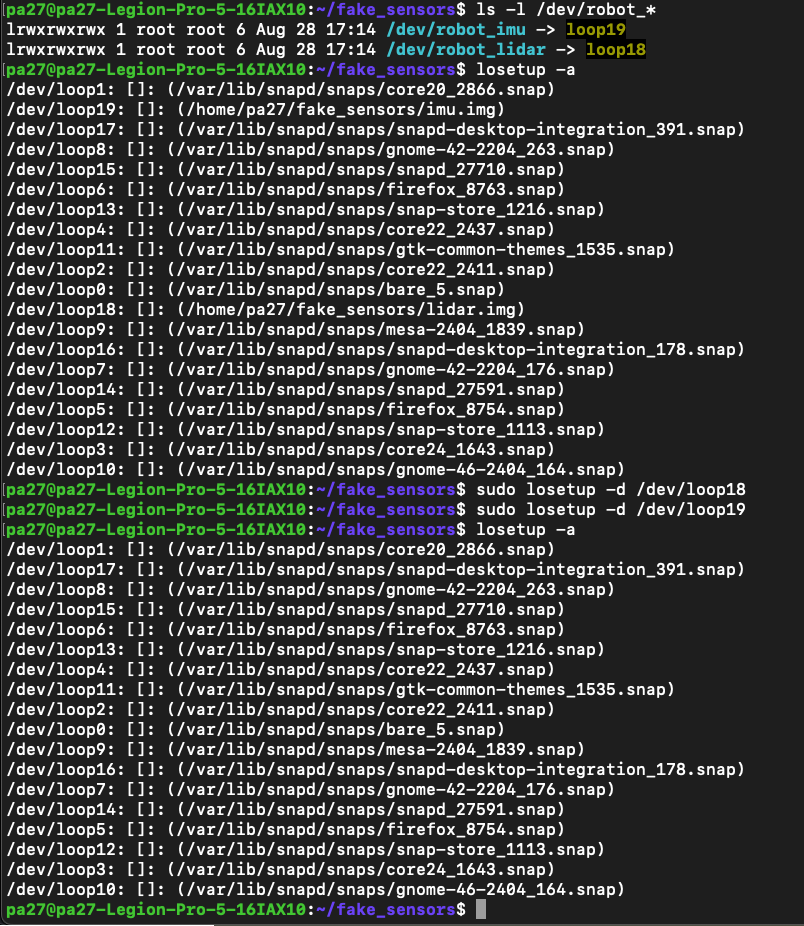

```bash
# 실제로 사용 중인 loop 번호만 확인한 뒤 해제
losetup -a
sudo losetup -d /dev/loop18 /dev/loop19

# IMU를 먼저, LiDAR를 다음에 연결
sudo losetup -f --show /home/pa27/fake_sensors/imu.img
sudo losetup -f --show /home/pa27/fake_sensors/lidar.img
sudo udevadm trigger
ls -l /dev/robot_*
readlink -f /dev/robot_lidar
readlink -f /dev/robot_imu
```

## 문제 3. 팀 저장소 협업 — 브랜치·커밋·CI

이번 작업은 Git 브랜치 전략에 맞춰 작업을 나누고, 각 브랜치에서 커밋한 뒤 CI로 상태를 확인하는 방식으로 진행했다.

1. **저장소 URL:** `___` / **PR URL:** `___`

2. **브랜치와 커밋**

```text
main                     기본 브랜치
feature/compute-layout   문제 1 연산 분담 문서 작업
feature/udev-rules       문제 2 udev 규칙과 설명 작업
```

각 기능은 별도 브랜치에서 작업하고 커밋했다. 작업이 끝난 뒤 CI를 실행해 문서와 파일 상태를 확인했다.

3. **PR 리뷰와 충돌 해결**

실제 제출에서는 PR을 열어 리뷰 코멘트를 남기고 반영 커밋을 추가하는 방식으로 진행하면 된다. 같은 파일의 같은 줄을 두 브랜치에서 다르게 수정하면 충돌이 발생한다.

| 표식 | 의미 |
|---|---|
| `<<<<<<< HEAD` | 현재 브랜치의 내용 시작 |
| `=======` | 두 변경 내용을 나누는 경계 |
| `>>>>>>> branch-b` | 병합하려는 브랜치의 내용 끝 |

필요한 내용만 남기고 충돌 표식을 삭제한 뒤 다시 커밋하면 충돌이 해결된다.

4. **merge와 rebase 이력 비교**

```bash
git log --oneline --graph --all
```

merge는 병합 커밋이 남아서 두 브랜치가 합쳐진 흐름이 보이고, rebase는 커밋을 최신 `main` 뒤로 다시 이어 붙여 한 줄처럼 보인다.

5. **팀 규칙**

개인 작업 브랜치는 `main`에 바로 올리지 않고 기능별 브랜치에서 작업한다. 공유된 브랜치는 기록을 바꾸지 않도록 merge를 사용하고, 혼자 작업 중인 브랜치를 최신화할 때만 rebase를 사용한다. CI가 통과한 커밋만 병합한다.
